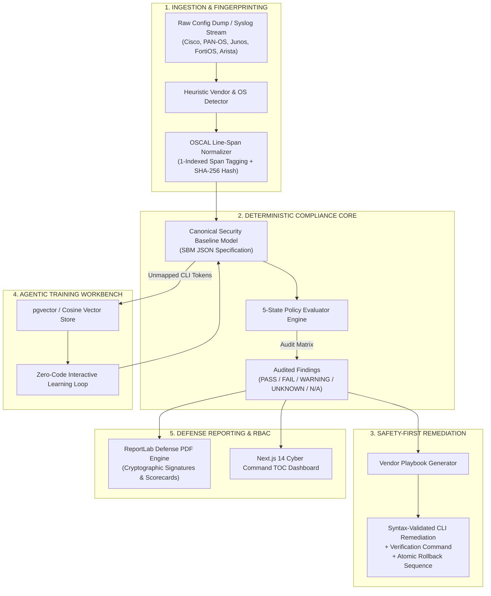

# SENTINEL-NET: AI-Driven Multi-Vendor Network Security Compliance Auditor

<div align="center">


**Enterprise & Defense-Grade Multi-Vendor Network Configuration Auditing, 5-State Compliance Evaluation, Vector-Based Unknown Syntax Training, and Safe Playbook Remediation.**

*Developed for the Smart India Hackathon (SIH 2026) | Problem Statement ID: 26155 (NTRO / NCIIPC)*

</div>

---

## 1. Executive Summary & Problem Context

Modern enterprise and critical national infrastructure (CNI) networks are inherently heterogeneous, running hardware and firmware across dozens of competing vendors (Cisco, Palo Alto Networks, Juniper, Fortinet, Arista, Check Point, SONiC, and Cloud Security Groups). Auditing these configurations against defense-grade frameworks (**NIST SP 800-53 Rev 5, CIS Benchmarks, DISA STIGs, and ISO/IEC 27001**) is traditionally crippled by:

1. **Vendor Syntax Fragmentation**: Incompatible CLI commands, XML schemas, and hierarchical JSON dumps.
2. **False Confidence from Incomplete Dumps**: Labeling missing `show` commands as "Compliant" instead of flagging missing operational evidence.
3. **Dangerous Auto-Remediation**: Applying uncontrolled script execution directly to mission-critical routing backbones.
4. **Static Rule Brittleness**: Every new vendor firmware update breaks hard-coded regex parsers.

**Sentinel-Net solves this with a deterministic, policy-as-code core paired with an agentic vector similarity training loop:**
- **OSCAL-Aligned Line Spans**: Every audit finding links to 1-indexed line spans in the raw configuration with SHA-256 cryptographic integrity hashes.
- **5-State Compliance Logic**: Strictly enforces `PASS`, `FAIL`, `WARNING`, `UNKNOWN`, and `NOT_APPLICABLE` (never marks unobserved sections as passed).
- **Proposal-Only Safe Remediation**: Dual-action CLI playbooks paired with prerequisite validation commands and atomic rollback sequences.
- **Dynamic AI Training Workbench**: Translates unmapped proprietary CLI syntax into canonical `SecurityBaselineModel` schemas using `pgvector` vector similarity.
- **Air-Gapped / Offline Resilient**: Runs 100% locally with zero external API dependencies required for core auditing and report generation.

---

## 2. End-to-End System Architecture



---

## 3. Core Technical Capabilities

### A. Universal Security Baseline Model (SBM)
Normalizes disparate network configuration commands into an extensible, vendor-neutral structure:
- **Authentication & Access**: SSHv2 enforcement, telnet deactivation, HTTP/HTTPS management status, exec-timeout threshold, legal warning banners.
- **Account Security**: Minimum password length, cryptographic hashing (`sha256` / `scrypt` / `type-9`), default service account disables, MFA flags.
- **Network & Services**: SNMPv3 encryption, default read community purging, centralized syslog destinations, NTP synchronization servers.
- **Line-Span Evidence**: Exact `line_start` and `line_end` positions linking each parsed security parameter back to its source configuration.

### B. 5-State Findings Model
Unlike simplistic binary checkers, Sentinel-Net uses a five-state classification:
- `PASS`: Configuration line explicitly satisfies the benchmark control.
- `FAIL`: Configuration line violates the benchmark rule.
- `WARNING`: Partial match or sub-optimal configuration requiring administrator attention.
- `UNKNOWN`: Insufficient evidence in the provided dump (requires live show-commands).
- `NOT_APPLICABLE`: Control does not apply to the identified device category.

### C. Proposal-Only Remediation with Verification & Rollback
To prevent network outages, no command is executed blindly:
```
┌─────────────────────────────────────────────────────────────┐
│ 1. Verification Command (Checks current interface state)    │
│    # show ip interface brief                                │
├─────────────────────────────────────────────────────────────┤
│ 2. Remediation Command (Applies hardened configuration)     │
│    (config)# exec-timeout 10 0                              │
├─────────────────────────────────────────────────────────────┤
│ 3. Atomic Rollback Command (Restores previous baseline)     │
│    (config)# no exec-timeout                                │
└─────────────────────────────────────────────────────────────┘
```

### D. Multi-Vendor Support Matrix

| Vendor / Platform | CLI Syntax / Model | Auto-Detection | 5-State Audit | CLI Playbook Remediation |
| :--- | :--- | :---: | :---: | :---: |
| **Cisco Systems** | IOS, IOS-XE, ASA, CUCME | ✅ Full | ✅ Full | ✅ Full |
| **Palo Alto Networks** | PAN-OS (Set / XML hierarchy) | ✅ Full | ✅ Full | ✅ Full |
| **Juniper Networks** | Junos OS (Hierarchical / Set) | ✅ Full | ✅ Full | ✅ Full |
| **Fortinet** | FortiOS (`config sys / set`) | ✅ Full | ✅ Full | ✅ Full |
| **Arista Networks** | EOS (CloudVision CLI) | ✅ Full | ✅ Full | ✅ Full |
| **Cloud Firewalls** | AWS Security Groups / Azure NSG | ✅ Full | ✅ Full | ✅ Full |

---

## 4. Quick Start: Single-Command Docker Deployment

The entire stack (**Frontend, Backend, PostgreSQL 16 + pgvector, and Redis**) starts with a single command.

### Prerequisites:
- [Docker Desktop](https://www.docker.com/products/docker-desktop/) installed and running.

### 1-Step Execution:

```bash
# Clone the repository
git clone https://github.com/VECTOR-SIH/sih-_2026.git
cd sih-_2026

# Launch all microservices in the background
docker compose up --build -d
```

### Deployed Services:

| Service | Port | Accessible URL | Purpose |
| :--- | :---: | :--- | :--- |
| **Frontend UI** | `3000` | [http://localhost:3000](http://localhost:3000) | Next.js Tactical Command Dashboard |
| **Backend API** | `8000` | [http://localhost:8000](http://localhost:8000) | FastAPI Core Auditor Engine |
| **Interactive Docs**| `8000` | [http://localhost:8000/docs](http://localhost:8000/docs) | OpenAPI / Swagger Documentation |
| **PostgreSQL + pgvector** | `5432` | `localhost:5432` | Canonical Vector Similarity Database |
| **Redis** | `6379` | `localhost:6379` | Message Queue & Real-Time Caching |

### Monitoring & Teardown:

```bash
# View real-time aggregated service logs
docker compose logs -f

# View backend auditor logs specifically
docker compose logs -f backend

# Stop all services gracefully
docker compose down

# Stop and wipe persistent volume data (Clean Reset)
docker compose down -v
```

---

## 5. Manual Local Development (Without Docker)

If you prefer running services natively on your host machine:

### Prerequisites:
- Python 3.11+
- Node.js 18+ and npm

### 1. Backend Service Setup:

```bash
# Open terminal in project root
cd sih_mock

# Create and activate virtual environment
python -m venv venv
# On Windows:
.\venv\Scripts\activate
# On Linux/macOS:
source venv/bin/activate

# Install dependencies
pip install -r backend/requirements.txt

# Launch FastAPI server
uvicorn backend.main:app --reload --port 8000
```
Backend will be live at `http://localhost:8000` with interactive Swagger docs at `http://localhost:8000/docs`.

### 2. Frontend Command UI Setup:

```bash
# Open a second terminal in frontend directory
cd sih_mock/frontend

# Install node dependencies
npm install

# Start development server
npm run dev
```
Open `http://localhost:3000` in your web browser.

---

## 6. Verification & Automated Testing

Sentinel-Net includes end-to-end unit and workflow tests covering vendor detection, OSCAL normalizer line-spans, 5-state evaluations, report generation, and AI agent failover pools:

```bash
# Run complete test suite (from project root)
python -m pytest backend/ -v
```

Expected output:
```
backend/test_agentic_workflow.py::test_dynamic_skills_loading PASSED
backend/test_agentic_workflow.py::test_ai_failover_pool PASSED
backend/test_agentic_workflow.py::test_task_routing_engine PASSED
backend/test_agentic_workflow.py::test_end_to_end_audit_to_remediation_task PASSED
backend/test_sentinel.py::test_vendor_detector_cisco PASSED
backend/test_sentinel.py::test_vendor_detector_juniper PASSED
backend/test_sentinel.py::test_vendor_detector_palo_alto PASSED
backend/test_sentinel.py::test_config_normalizer_cisco PASSED
backend/test_sentinel.py::test_compliance_evaluator_scoring PASSED
backend/test_sentinel.py::test_remediation_generator PASSED
backend/test_sentinel.py::test_pdf_report_generator PASSED
backend/test_sentinel.py::test_vector_store_learning PASSED
============================== 12 passed in 0.28s ==============================
```

---

## 7. Key REST API Endpoints

| Method | Endpoint | Description |
| :--- | :--- | :--- |
| `GET` | `/` | System health check, loaded agentic skills, and AI pool status |
| `POST` | `/api/verify` | Uploads raw config/syslog, performs normalization and 5-state audit |
| `POST` | `/api/export-pdf` | Generates defense-grade ReportLab PDF compliance audit report |
| `POST` | `/api/train-vector` | Maps unparsed CLI command into `pgvector` similarity vector space |
| `GET` | `/api/inventory` | Fetches discovered network device assets and health telemetry |
| `GET` | `/api/logs` | Centralized network telemetry and security event log stream |
| `GET` | `/api/v1/skills` | Lists dynamic vendor parsing skills and regex rules |
| `POST` | `/api/v1/skills/update` | Updates or registers a new vendor parsing rule pack in runtime |
| `GET` | `/api/v1/tasks` | Lists remediation tasks and tickets on the SOC Kanban board |
| `POST` | `/api/v1/tasks/assign`| Reassigns a remediation ticket with role verification (RBAC) |

---

## 8. Compliance Framework Reference Matrix

| Framework | Control ID | Rule Description | Enforced Requirement |
| :--- | :--- | :--- | :--- |
| **NIST SP 800-53 Rev 5** | `AC-2 / AC-12` | Session Termination & Idle Timeout | `exec_timeout <= 600` seconds |
| **NIST SP 800-53 Rev 5** | `IA-5(1)` | Authenticator Password Hashing | Cryptographic hash (`sha256` / `scrypt`) |
| **NIST SP 800-53 Rev 5** | `SC-8` | Cleartext Protocol Prohibition | `telnet_enabled == false`, `http == false` |
| **CIS Benchmark v8** | `1.1` | Mandatory Secure Shell | `ssh_version == 2` AND `ssh_enabled == true` |
| **CIS Benchmark v8** | `2.2` | SNMP Community Protection | `snmp_version == 'v3'` & no default communities |
| **DISA STIG** | `STIG-NET-002` | Legal Warning Login Banner | `login_banner_configured == true` |
| **ISO/IEC 27001** | `A.12.4.1` | Remote Centralized Logging | `logging_syslog_enabled == true` |

---

## 9. Security & Clearance

- **Classification**: UNCLASSIFIED / FOR OFFICIAL USE ONLY (FOUO).
- **Security Posture**: API secrets, private keys, and Firebase service accounts are loaded strictly from environment variables and excluded from source control via `.gitignore`.
- **Intended Deployment**: Air-gapped Tactical Operations Centers (TOC), Security Operations Centers (SOC), and enterprise cyber command networks.

---

<div align="center">
<b>Sentinel-Net: Precision Network Security Compliance & Remediation</b><br/>
Built with pride for Smart India Hackathon 2026.
</div>
