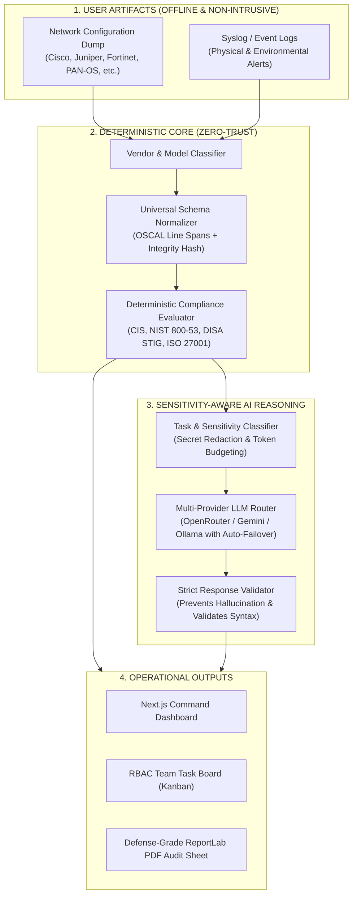

# VECTORNET: AI-Powered Multi-Vendor Network Security Compliance Auditor

<div align="center">


**Read-only, non-intrusive network configuration auditing, deterministic compliance validation, sensitive data protection, multi-provider LLM routing, and role-based remediation task management.**

*Developed for Smart India Hackathon (SIH 2026) | Problem Statement ID: 26155 (NTRO / NCIIPC)*

</div>

---

## 📑 Table of Contents

1. [🚀 Step-by-Step Download & Installation Guide](#-step-by-step-download--installation-guide)
2. [🎯 Problem Statement & Solution Mapping](#-problem-statement--solution-mapping)
3. [🏗️ High-Level System Architecture](#️-high-level-system-architecture)
4. [⚡ Core Capabilities & Technical Highlights](#-core-capabilities--technical-highlights)
5. [🔌 Multi-Vendor Support Matrix](#-multi-vendor-support-matrix)
6. [📋 Key API Endpoints](#-key-api-endpoints)
7. [🧪 Running Tests & Verification](#-running-tests--verification)
8. [🔒 Non-Intrusive Safety & Security Architecture](#-non-intrusive-safety--security-architecture)

---

## 🚀 Step-by-Step Download & Installation Guide

Follow these simple steps to download and run VectorNet locally on your machine.

### 📌 Prerequisites

Ensure you have the following installed on your operating system (Windows, macOS, or Linux):

- **Python**: `3.10` or higher (`python --version`)
- **Node.js**: `18.x` or `20.x` LTS (`node -v`)
- **Git**: (`git --version`)
- *(Optional)* **Docker Desktop**: if you prefer 1-command container execution.

---

### Method 1: Local Native Installation (Recommended)

#### Step 1: Clone the Repository
```bash
git clone https://github.com/VECTOR-SIH/sih-_2026.git
cd sih-_2026
```

#### Step 2: Set Up and Start the Python Backend

Open a terminal in the project root folder:

```bash
# 1. Create a Python virtual environment
python -m venv venv

# 2. Activate the virtual environment
# On Windows (PowerShell):
.\venv\Scripts\Activate.ps1
# On Windows (Command Prompt):
.\venv\Scripts\activate.bat
# On Linux / macOS:
source venv/bin/activate

# 3. Install backend dependencies
pip install -r backend/requirements.txt

# 4. Start the FastAPI backend server
python -m uvicorn backend.main:app --host 0.0.0.0 --port 8000 --reload
```

> 🟢 **Backend will be live at:** [http://localhost:8000](http://localhost:8000)  
> 📖 **Interactive Swagger Docs:** [http://localhost:8000/docs](http://localhost:8000/docs)

---

#### Step 3: Set Up and Start the Next.js Frontend

Open a **new terminal window** and navigate to the `frontend` folder:

```bash
# 1. Enter the frontend directory
cd frontend

# 2. Install Node dependencies
npm install

# 3. Start the Next.js development server
npm run dev
```

> 🌐 **Open the Web UI in your browser:** [http://localhost:3000](http://localhost:3000)

---

#### Step 4: (Optional) Configure LLM Providers & API Keys

VectorNet features an **offline-first deterministic engine** that works 100% locally without any API keys. If you wish to enable the AI reasoning layer with OpenRouter or Google Gemini:

1. Open the Web UI at [http://localhost:3000](http://localhost:3000).
2. Click **AI Router & Keys** in the sidebar.
3. Paste your **OpenRouter API Key** or **Google Gemini API Key** and click **Add Key**.
4. Select your preferred active model (e.g., `meta-llama/llama-3.3-70b-instruct:free`, `google/gemini-2.0-flash`, etc.).
5. *Alternatively*, create a `.env` file in the project root:
   ```env
   OPENROUTER_API_KEY=your_openrouter_api_key_here
   GEMINI_API_KEY=your_gemini_api_key_here
   ```

---

### Method 2: Single-Command Docker Deployment

If you have Docker Desktop installed, launch the entire stack (Frontend, Backend, and Datastores) with one command:

```bash
# Clone and enter repo
git clone https://github.com/VECTOR-SIH/sih-_2026.git
cd sih-_2026

# Build and start all services
docker compose up --build -d
```

To stop:
```bash
docker compose down
```

---

## 🎯 Problem Statement & Solution Mapping

| # | Challenge | VectorNet Solution | Technical Mechanism |
|:---:|:---|:---|:---|
| **01** | **Multi-Vendor Complexity**<br/>Cisco, Juniper, Fortinet, Palo Alto all use different CLI syntax and data structures. | **Universal Normalization** | Parses disparate CLI configs and logs into a single vendor-neutral JSON Security Baseline Model (SBM). |
| **02** | **Manual Compliance Auditing**<br/>Manual reviews through CLI/GUI cause delays, high effort, and human error. | **Automated Hybrid Auditing** | Evaluates files against security benchmarks in milliseconds using deterministic rules combined with AI pattern analysis. |
| **03** | **Configuration Drift**<br/>Inconsistent device posture violates CIS, NIST, DISA STIG, and ISO standards. | **Remediation Guidance & Team Tasking** | Suggests vendor-accurate CLI fix scripts and automatically routes prioritized remediation tickets to responsible engineers. |
| **04** | **No Real-Time Visibility**<br/>No centralized view of device configuration, compliance status, and remediation progress. | **Centralized Command Hub** | Single dashboard showing fleet compliance scores, risk classifications, audit logs, and downloadable PDF reports. |

---

## 🏗️ High-Level System Architecture



---

## ⚡ Core Capabilities & Technical Highlights

### 1. Universal Security Baseline Model (SBM)
Normalizes diverse network CLIs into a vendor-neutral schema covering:
- **Authentication & Access**: SSH version enforcement, Telnet deactivation, exec-timeout settings, pre-logon warning banners.
- **Account Security**: Password encryption hashing (Type-7 prohibition, SHA-256/scrypt requirements), default account checks.
- **Network & Services**: Insecure HTTP disablement, SNMPv3 encryption, removal of default community strings, remote syslog host configuration.
- **Line-Span Evidence**: Exact 1-indexed line numbers linking every audit finding back to source configuration text.

### 2. Sensitivity-Aware Multi-LLM Routing & Failover
- **Sensitive Config Protection**: Redacts pre-shared keys, passwords, and private IP ranges before external reasoning.
- **Context Minimization**: Sends normalized summaries and deterministic findings to LLMs rather than massive raw dumps.
- **Auto-Failover Pool**: Rotates through API keys and model tiers on rate limits or outages without interrupting audits.
- **Response Validation**: Validates AI outputs against deterministic ground truth to prevent hallucination.

### 3. Read-Only, Non-Intrusive Operation
- **Zero Device Modification**: Operates strictly on user-provided configuration text and log files. Never pushes unverified commands to live production equipment.
- **Remediation Suggestions**: Provides copy-pasteable, vendor-accurate CLI fix scripts for human review and authorization.

### 4. Role-Based Team Tasking (RBAC Kanban)
- Automatically converts `CRITICAL` and `HIGH` compliance violations into actionable tasks.
- Supports role-based assignment between **Super Admin**, **Security Auditor**, and **Network Operator**.

---

## 🔌 Multi-Vendor Support Matrix

| Vendor / Platform | CLI Syntax / Model | Auto-Detection | 5-State Audit | Remediation Playbooks |
| :--- | :--- | :---: | :---: | :---: |
| **Cisco Systems** | IOS, IOS-XE, ASA, CUCME | ✅ Supported | ✅ Supported | ✅ Supported |
| **Juniper Networks** | Junos OS (Hierarchical / Set) | ✅ Supported | ✅ Supported | ✅ Supported |
| **Fortinet** | FortiOS (`config sys / set`) | ✅ Supported | ✅ Supported | ✅ Supported |
| **Palo Alto Networks** | PAN-OS (Set / XML hierarchy) | ✅ Supported | ✅ Supported | ✅ Supported |
| **SONiC** | Enterprise Whitebox CLI / JSON | ✅ Supported | ✅ Supported | ✅ Supported |
| **Cloud Firewalls** | AWS Security Groups / Azure NSG | ✅ Supported | ✅ Supported | ✅ Supported |
| **Huawei** | VRP CLI Commands | ✅ Supported | ✅ Supported | ✅ Supported |

---

## 📋 Key API Endpoints

| Method | Endpoint | Purpose |
| :--- | :--- | :--- |
| `GET` | `/` | Operational health check, engine type, loaded skills, and AI pool status |
| `POST` | `/api/v1/config/parse` | Parses raw configuration text into canonical Security Baseline Model (SBM) |
| `POST` | `/api/v1/normalize` | Normalizes CLI text into standardized Universal JSON Schema |
| `POST` | `/api/v1/audit/evaluate` | Evaluates configuration compliance against CIS, NIST, STIG, and ISO |
| `POST` | `/api/v1/ai/query-failover`| Routes prompt to active LLM provider with automated failover |
| `GET` | `/api/v1/ai/config` | Retrieves active AI model, provider, and masked API key pool |
| `POST` | `/api/v1/ai/config` | Configures active model or appends new API keys to pool |
| `GET` | `/api/v1/skills` | Lists dynamic vendor parsing skills and benchmark rules |
| `POST` | `/api/v1/skills/update` | Updates a vendor skill profile and hot-reloads the rule engine |
| `GET` | `/api/v1/tasks` | Lists remediation tasks on the SOC Kanban board |
| `POST` | `/api/v1/tasks/assign` | Assigns a remediation task to a specific team member |
| `POST` | `/api/v1/report/pdf` | Generates a defense-grade ReportLab PDF compliance audit sheet |

---

## 🧪 Running Tests & Verification

VectorNet includes comprehensive test suites covering parsing, deterministic rules, multi-LLM failover, and task routing:

```bash
# Run unit tests across all engine components
python -m pytest backend/tests/ -v

# Run end-to-end dataset audit tests
python backend/test_dataset_audit.py

# Verify clean deterministic pipeline (no dummy fallbacks)
python -c "from backend.app.engines.orchestrator import audit_orchestrator; print('Pipeline operational')"
```

---

## 🔒 Non-Intrusive Safety & Security Architecture

1. **Air-Gapped & Offline Capable**: Core deterministic parsing, compliance rule scoring, and PDF generation work entirely offline without requiring external network connectivity.
2. **Secrets Never Committed**: All API keys and environment configurations are excluded via `.gitignore`.
3. **No Automatic Live Pushes**: The system is designed strictly as an auditor and decision-support tool. It empowers network engineers with evidence and guidance rather than making risky automated network changes.

---

<div align="center">
<b>VectorNet: Precision Multi-Vendor Network Compliance & Auditing Engine</b><br/>
Built with pride for Smart India Hackathon 2026.
</div>
